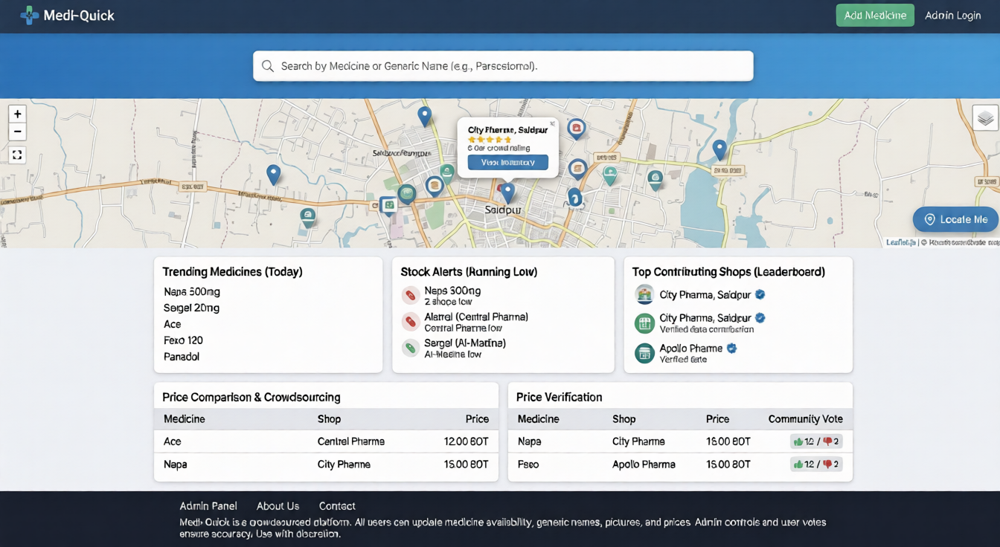

# Medi-Quick 🏥
### A Crowdsourced Medicine Inventory & Pricing Research Platform



> **Live Demo:** [medi-quick-fawn.vercel.app](https://medi-quick-fawn.vercel.app/)  
> **Developed by:** Md. Shahriyar Rahim  
> **Designed by:** Shammi Ayeman Mantasa  
> **Institution:** Bangladesh Army University of Science & Technology (BAUST)  
> **Department:** Computer Science & Engineering (CSE)

---

## 📌 Project Overview
**Medi-Quick** is a community-driven web application designed to address local pharmacy inefficiencies. Unlike traditional inventory systems, Medi-Quick relies on crowdsourced data to provide real-time information on medicine availability and pricing. 

The platform allows anyone to contribute data without a login, while maintaining integrity through a community voting system and a robust administrative panel.

### 🔍 The Research Angle (Gap Analysis)
This project goes beyond simple software by serving as a research tool to identify:
- **Medicine Scarcity:** Tracking "searched-for-but-not-found" medicines to identify supply chain gaps.
- **Price Variance:** Analyzing price differences across different local pharmacies for the same generic medicine.
- **Stock Trends:** Monitoring which medicines are trending or running low in specific areas.

---

## ✨ Key Features
- **Interactive Map Search:** Uses Leaflet.js to visualize nearby pharmacies and their stock.
- **Generic Search:** Search by brand name (e.g., Napa) to find generic equivalents (e.g., Paracetamol).
- **Crowdsourced Updates:** Users can add new medicines, update prices, and change shop details instantly.
- **Price Verification:** A 👍/👎 voting system for community-led fraud detection and price accuracy.
- **Live Trends Dashboard:** Real-time metrics on most-bought medicines and low-stock alerts.
- **Authenticated Admin Panel:** A secure dashboard for admins to manage stores, delete fraudulent entries, and toggle public editing permissions.

---

## 🛠️ Tech Stack
- **Frontend:** React.js, Tailwind CSS, Leaflet.js (Maps)
- **Backend:** Node.js, Express.js
- **Database:** MongoDB
- **Deployment:** Vercel (Frontend), [Your Backend Host] (Backend)

---

## 🚀 Getting Started

### Prerequisites
- Node.js installed
- MongoDB URI

### Installation
1. **Clone the repository:**
   ```bash
   git clone [https://github.com/Shahriyar-Rahim/MediQuick.git](https://github.com/Shahriyar-Rahim/MediQuick.git)

```

2. **Install dependencies:**
```bash
# For Frontend
cd client
npm install

# For Backend
cd server
npm install

```


3. **Set up Environment Variables:**
Create a `.env` file in the server directory and add:
```env
MONGO_URI=your_mongodb_connection_string
JWT_SECRET=your_secret_key

```


4. **Run the Application:**
```bash
# Run Backend
npm start

# Run Frontend
npm run dev

```


---

## 🗺️ Roadmap

* [ ] AI-driven prediction for medicine shortages.
* [ ] Integration with local Blood Bank data.
* [ ] Prescription OCR (Optical Character Recognition) for easier searching.
* [ ] Mobile application version using React Native.

---

## 📄 License

This project is for academic purposes as part of the project showcase at the **Bangladesh Army University of Science & Technology**.

```
